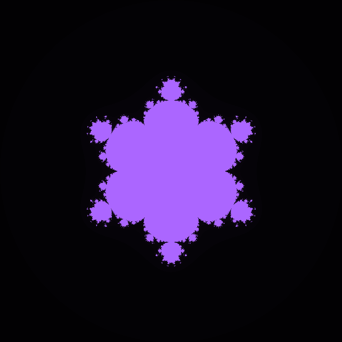

# Mandelbrot-Julia Sets

This small website shows (in a simplified way) the Mandelbrot and Julia sets.

The Home button shows the mandelbrot set, while by clicking on a point of the Gaussian plane the Julia Set of that number will be shown.
The Options button lets the user modify the colors of the sets and the exponent of the z(k+1) = z(k)^d + c series, changing this value will result in a so called "Multibrot set".

Lastly, the Save Button lets the user save the image shown.

Project made by @dede.artbit (on instagram)
